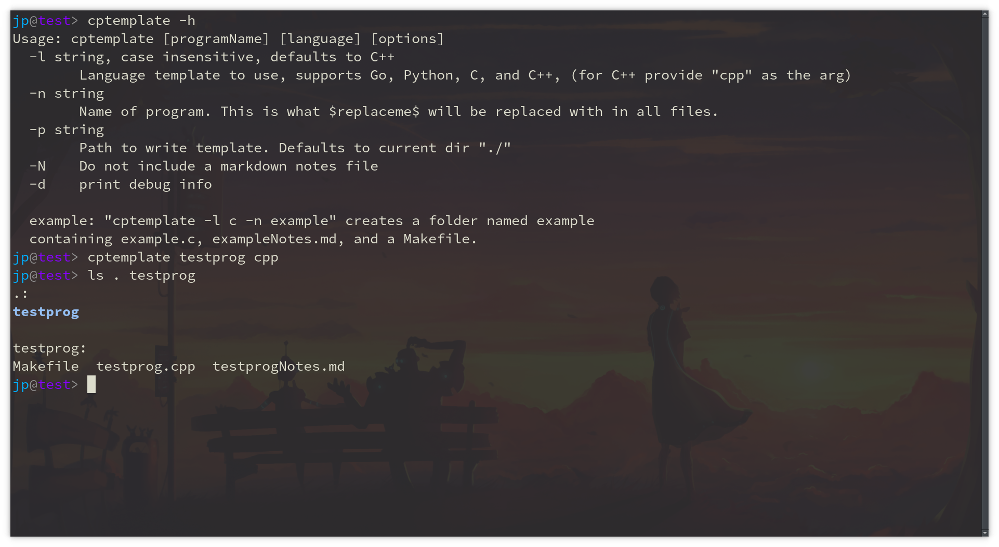

# Cptemplate
### A simple program template copier

Tired of handjaming the same 2 or 3 files everytime you need solve a quick problem or do a homework assignment?
Then this tool may help you out.

It works based off the template files included in the repo. You can modify them however you like, but adding
additional ones or adding a new language will require modifying the code. Its tested on linux, and will probably function
on Mac OS as well. It will not work for windows however.

## Usage
- `-l` Language supports C, C++, Python, Latex, Racket, Haskell, and Go. You can also provide "none" to create just a folder with a `README.md`.
- `-N` Include a `README.md` file (off by default). If "none" is passed as language this flag doesn't do anything.
- `-n` Program name. The name of the program or project, this is used to name the files and the directory.
- `-p` Path to location to place template folder. Defaults to current dir.
- `-h` Prints usage instructions and exits.

## Installation
Only dependency is Go. Reference this for installing Go https://go.dev/doc/install
1. Clone the repo
2. Run `make install` in repo dir and you should be prompted for a password to mv executeable to `/usr/local/bin`

## Modding the files
You can modify any of the templates, just keep in mind the rules for replacement below, and be sure to rerun `make install` after your done changing your templates.
1. The keyword `$replaceme$` will be replaced with the programName arg `-n` in all files created.
2. The keyword `$date$` will be replaced with the current date in `YYYY-MM-DD` format in all files created.

## Process Walkthrough
Given the command `cptemplate -l c -n example -N`
### In current dir
1. creates a folder called example
2. creates a source file `example.c`
3. creates a `Makefile` that compiles and runs `example.c`
4. creates a readme file `README.md`

If "blank" is given for the language arg steps 2,3 will be excluded.

## Building
Template files for build should be stored under `templates/<lang>`.

For example:
- `templates/c/source.c`
- `templates/c/Makefile`

The notes file should be stored at the root of templates `templates/programNotes.md`

